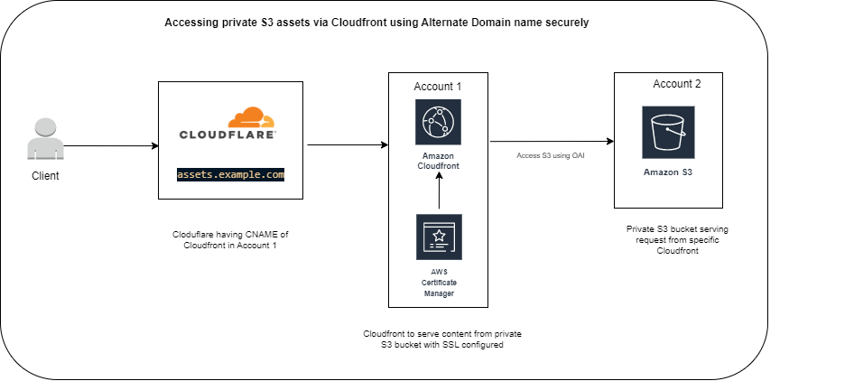
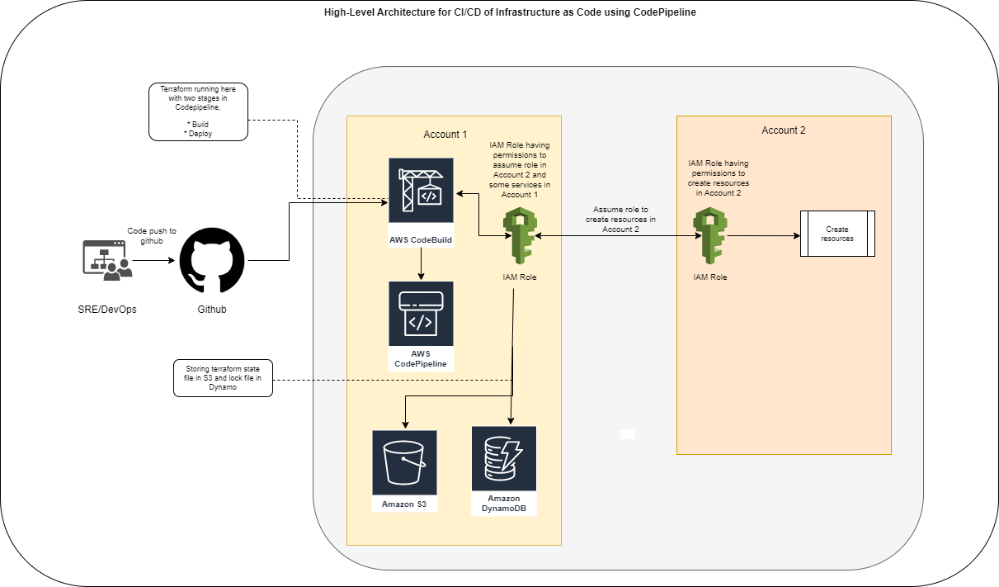

# bolt-task
Task for Bolt

#Technical Overview:
##Infrastructure side:

Question:
A team is requesting to serve content from a private S3 bucket by deploying a CloudFront Distribution on a different AWS account that the S3 bucket is hosted on. Content should be served from an Alternate domain name with SSL.

Solution:

For achieving this we would need to create Cloudfront Distribution and OAI in account 1. Also we would need to create ACM certificate for domain in account 1 so that we can add the certificate in Cloudfront for secure communication.

We would then need to create private S3 bucket. We need to add a bucket policy to have read access just from the Cloudfront we created in account 1.

##IaC side:

For IaC

For Infrastructure creation we will be using Terraform. For CI/CD of Infrastructure creation we would be using Github, AWS CodeBuild, AWS CodePipeline, AWS S3 and AWS DynamoDB. We will create three stages in AWS CodePipeline:
* Source
* Build
* Manual Approval
* Deploy

Source will be Github, whenever code is pushed in repository, CodePipeline will be triggered and step by step it will run the whole pipeline. CodePiepline Build stage will run *terraform plan* and Deploy stage will run *terraform apply* command. During the Build and Deploy stage, terraform state file will be stored in AWS S3 and lock file will be stored in DynamoDB.

#Installation guide:
To deploy this solution in an empty AWS account, we would need to create:
* IAM Role
* CodeBuild
* CodePipeline
* S3
* DynamoDB

###IAM Role:
Two Roles will be created:
* IAM Role in Account 1
* IAM Role in Account 2

IAM Role will be created in Account 1 for Codebuild as Codebuild will run terraform commands and create infrastructure in both the accounts. For creating resources in account 1 we will grant the permission using IAM policies, for creating resources in account 2 we will create a separate IAM Role and the Role created in Account 1 will assume that Role in Account 2 and create resources in that account.

###CodeBuild:
CodeBuild will be created for build and deployment of infrastructure using terraform. These are the stages which needs to be created:
* Source
* Build
* Manual Approval
* Deploy

In Source Stage, we would need to integrate CodeBuild with our Github.

The Spec file for Build and Deploy stages are added to the repo, CodeBuild will use those to install Terraform and run necessary commands.

###CodePipeline:
CodePipeline will be used to create Pipeline and CodeBuild stages will be added there.

###S3:
S3 needs to craeted to store the state file of Terraform. The bucket will be private and only IAM Role attached to CodeBuild can access this bucket.

###DynamoDB:
DynamoDB needs to be created as Terraform's Lock file will be stored.